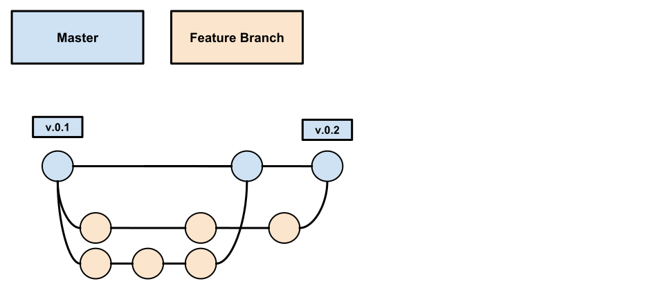
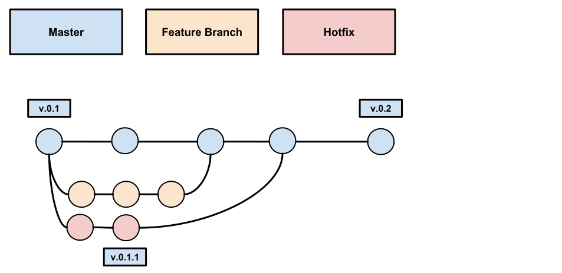

## Git

### Uso do GitFlow

Para o gerenciamento das funcionalidades e correções que estão sendo feitas no código, recomenda-se a utilização do seguinte procedimento:

* O repositório deve conter uma branch de dev e uma branch master - A branch dev deve se relacionar aquilo que está sendo desenvolvido e a branch master deve conter o código que refleta a versão atual de produção.


#### Feature Branches
* Todas as alterações no código, devem ser feitas em branches que são criadas a partir da branch dev, para isso execute os seguintes comandos:
```sh
git checkout dev
git pull origin dev
git checkout -b tipo/TRELLO-CARD-ID
```
* Ao finalizar a alteração no código, deve ser feito o rebase das alterações com a branch de dev para resolver possíveis conflitos de código que possam estar presentes e manter a branch de trabalho limpa, para isso deve ser executado os seguintes comandos:
```sh
git checkout dev
git pull origin dev
git checkout tipo/TRELLO-CARD-ID
git rebase origin dev
git push -f origin tipo/TRELLO-CARD-ID
```



* Após isso, deve ser criado um Pull Request (PR) para a branch de dev onde devemos descrever o impacto e o propósito daquela alteração no código, podendo inclusive conter - quando fizer sentido - exemplos (vídeos, screenshots, etc) das alterações. O Pull Request deve ser avaliado por outros membros do time, que devem fazer a revisão das alterações, e após algum membro do time revisar e aprovar as alterações, pode-se realizar o merge para a branch de dev.

* Após o merge, deve-se deletar a branch no repositório para evitar o acumulamento de branches que vai prejudicar a visibilidade do time sobre o que está pronto.

* Ao término do ciclo de desenvolvimento, para se realizar um deploy (no caso de React Native, a disponibilização de uma nova versão do app), deve-se criar um Pull Request da branch dev para a branch master, contendo uma descrição resumida das modificações.

* Ao se realizar o merge desse Pull Request deve-se criar uma tag no repositório, para facilitar posteriores reversões de versões e tracking de erros em versões de aplicativo já publicadas.


#### Definições de nomenclatura
Os nomes dos branches criados devem seguir o seguinte padrão de nomenclatura:

```
tipo/TRELLO-CARD-ID
```

Onde o tipo deve se relacionar ao que aquela branch busca resolver, por exemplo, se será desenvolvida uma funcionalidade nova, se será implementada uma correção, etc.

Alguns tipos possíveis são os seguintes:

* feat (será implementada uma nova funcionalidade)
* fix (será implementada uma correção para resolver um problema existente)
* refactor (será realizado algum refactor em parte do código que já funciona)
* chore (será implementa alguma melhoria de código e/ou infraestrutura)
* test (será desenvolvido algum novo cenário de teste para a aplicação)
* docs (será feita alguma mudança na documentação)

Já no TRELLO-CARD-ID deve ser descrito o id do card para aquela história no JIRA do projeto.

Exemplos:

* feat/BOARD-1 - Nessa branch fica claro que está sendo desenvolvida uma nova funcionalidade e que ela se refere a história BOARD-1
* fix/BOARD-2 - Nessa branch também fica claro que está sendo realizada uma correção no que se refere a história BOARD-2

##### Mensagens de commit
Para as mensagens de commit também deve-se seguir o seguinte esquema de nomenclatura:

```
tipo(TRELLO-CARD-ID): mensagem
```

Aqui, o tipo e o TRELLO-CARD-ID devem se referir a branch que está sendo utilizada para o desenvolvimento. Já a mensagem deve descrever brevemente o conteúdo daquela alteração.

A vantagem de manter o tipo e o TRELLO-CARD-ID na mensagem de commit é que após realizado o merge a informação da origem daquela modificação fica explicíta e facilita muito a identificação e investigação de possíveis erros no código.

##### Mensagens de commit com descrição longa
Para as mensagens de commit que necessitarem de uma descrição mais detalhada do que foi implementado, recomendamos o seguinte padrão:

```
tipo(TRELLO-CARD-ID): resumo da mensagem

A mensagem detalhada da implementação.
```

#### Hot Fixes (Maintenance Branches)

O fluxo de hotfixes deve ser bem semelhante ao fluxo usado para fixes, a diferença neste caso é que um hotfix deve nascer a partir da branch master, possibilitando enviar correções diretamente para a branch de produção sem necessariamente enviar correções e novas features presentes na branch de desenvolvimento. Esse tipo de fluxo deve ser usado quando algum erro crítico acontece em produção e precisa ser corrigido com certa urgência - que impossibilita esperar o fluxo de release da branch dev.



Ao finalizar o hotfix deve-se abrir um PR tanto para a branch master quanto para a branch dev, para que a correção esteja também presente na próxima release.

```sh
git checkout master

git pull origin master

git checkout hotfix/TRELLO-CARD-ID
```

#### Controle de versão
Para o controle de versão recomendamos a manutenção de um arquivo de changelog CHANGELOG.md versionado dentro do repositório onde deve conter as atualizações de versão do aplicativo.

O arquivo terá uma estrutura como abaixo:

```
# CHANGELOG

## 1.1.0 (2018-04-23)

  - [TRELLO-CARD-4]

## 1.0.0 (2018-04-22)

  - [TRELLO-CARD-1]
  - [TRELLO-CARD-2]
  - [TRELLO-CARD-3]

...

```

Esse arquivo deve ser atualizado após cada release em produção do aplicativo para manter o histórico de possíveis versões instaladas em dispositivos e as mudanças entregues em cada release.

#### Incremento de versão semântico

Para melhorar a previsibilidade das releases, recomenda-se a utilização do versionamento semântico (semver) que resumidamente, divide as releases em três tipos MAJOR, MINOR E PATCH. Cada release deve ser categorizada em um dos três tipos da seguinte maneira:

##### MAJOR

Deve-se fazer um release MAJOR (1.0.0 -> 2.0.0) quando são liberadas funcionalidades novas que necessitem adicionar módulos nativos na aplicação, ou funcionalidades que mudem drasticamente o funcionamento/estrutura/layout do aplicativo.

##### MINOR

Deve-se fazer um release MINOR (1.0.0 -> 1.1.0) quando são liberadas funcionalidades incrementais a uma versão, sem a necessidade de novos módulos nativos e também sem grandes alterações estruturais no aplicativo.

##### PATCH

Deve-se fazer um release PATCH (1.0.0 -> 1.0.1) quando são liberadas correções para a aplicação em produção, nesse caso não podem ser adicionados/removidos módulos nativos e dependendo do caso podem ser utilizadas ferramentas como o Microsoft App Center (aka Code Push) para evitar o tempo de aprovação e revisão das lojas de aplicativos.

#### Referências

* [Gitflow Workflow by Vicent Driessen](http://nvie.com/posts/a-successful-git-branching-model/)
* [GitFlow Workflow by Atlassian](https://www.atlassian.com/git/tutorials/comparing-workflows/gitflow-workflow)
* [Karma Commit Messages](http://karma-runner.github.io/1.0/dev/git-commit-msg.html)
* [Semantic Versioning](https://semver.org/)

### Trabalhando com branches

Dado que uma branch <nome_da_branch> está atrás da `master`, você pode seguir o seguinte processo, para atualizar ele com a master:

 1. Verifique se todas as mudanças feitas estão commitadas e que nada ficou no em `stash`;
 2. Faça um push para a branch remota: `git push origin <sua-branch>`
 3. Retorne a branch master: `git checkout master`
 4. Atualize a master: `git pull origin master`
 5. Volte para a sua branch: `git checkout <sua-branch>`
 6. Faça rebase da master: `git rebase master`
 7. Se conflitos aparecerem, resolva eles e então adicione as resoluções (`git add <arquivo-arrumado>`), e após resolver todos os conflitos continue o rebase (`git rebase --continue`)
 8. Após o rebase você agora precisa atualizar a sua branch remota: `git push -f` (sim `-f`, porquê após o rebase os seus commits tiveram seus hashes atualizados)
 9. Agora você pode finalmente criar o Pull Request (PR) e pegar um pouco de café.
